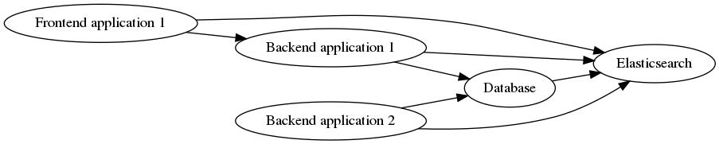
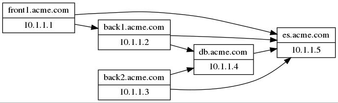

# Dependencies cartographier

## What is `dep-carto`

`dep-carto` describe dependencies between components.

It is composed of :
- a server that stores and exposes registered dependencies (push mode)
- a dependency crawler that parses configuration files and registers dependencies to the server

## `dep-carto` use-cases

Let's consider this architecture (acme company).

Which components depends on Elasticsearch ? Which components will be impacted if Elasticsearch goes down ?

Once dependencies crawled, `dep-carto` can build this kind representation :

## Getting `dep-carto`

### Binary release

### Docker

## Configuration
